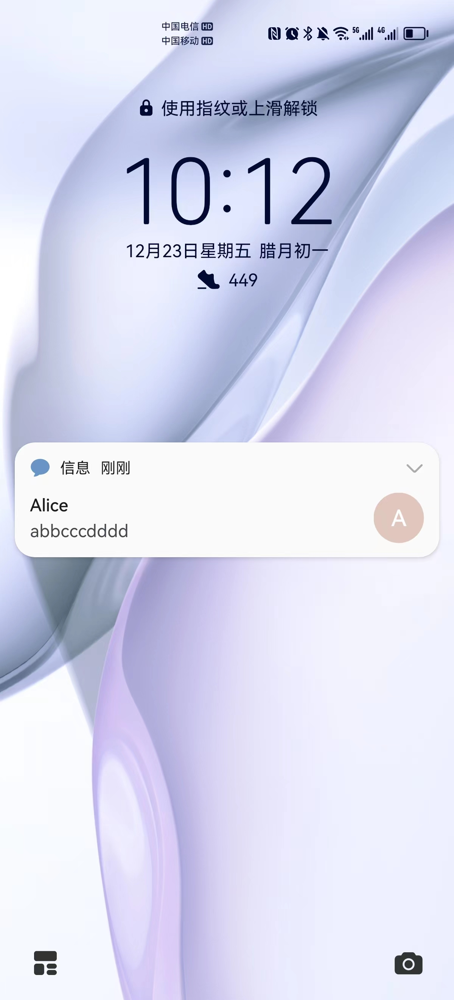
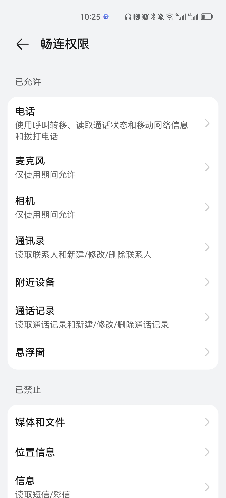
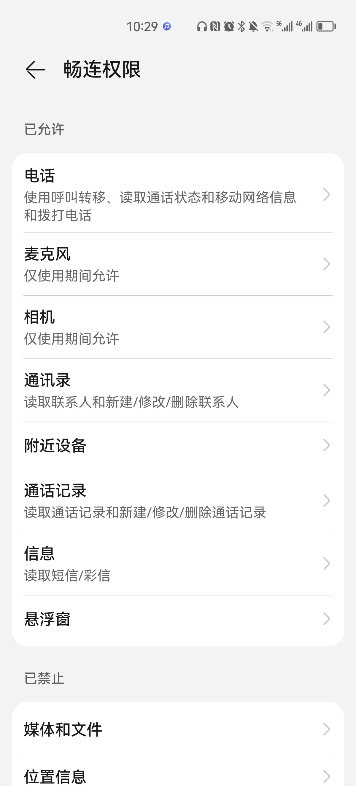
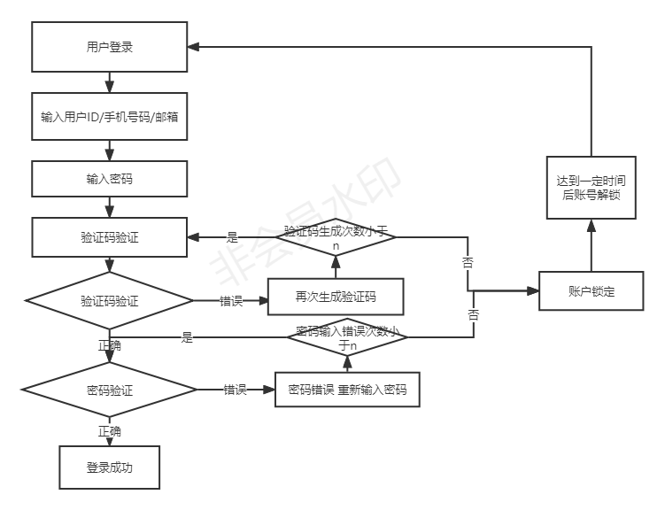

# 实验二 操作系统的控制设计

## 一、实验目的

以 `Android` 系统为研究对象，对操作系统的访问控制进行研究。

## 二、实验环境

操作系统版本：`harmonyOS 3.0.0`

硬件设备型号：HUAWEI P40 Pro

## 三、实验结果

### 当系统处于锁屏状态下接收到新短信时，不解锁情况下

* 系统是否允许查看短信内容？允许

* 系统是否允许回复短信？不允许，需要先解锁

* 安卓上的 App : 以**畅连**为例，在接管了系统短信功能和权限之后，是否会有一些不同的功能设定? **会有，显示需要修改手机默认设置，使用系统自带，显示为仅可读不可回复。**

### 当系统处于锁屏状态下，使用系统内置（例如 iOS 的 Siri ）或第三方的语音助手可以完成以下哪些操作？

使用系统内置第三方语音助手小艺。以下所有操作都需要语音助手对说话人进行声纹识别，非机主不能进行唤起。机主唤起后可完成情况如下。

- 访问通讯录 **不可以，需要先解锁**

- 拨打电话 **可以**

- 访问相册 **不可以，需要先解锁**

- 查看短信收件箱 **不可以，需要先解锁**

### 如果你的手机支持指纹识别解锁手机，请实验并分析指纹识别相比较于简单密码、复杂密码、图形解锁、人脸识别解锁、声纹解锁等解锁方式的安全性、便利性差异。

| **密码类型** | **安全性**                                                   | **便利性**                                                   |
| ------------ | ------------------------------------------------------------ | ------------------------------------------------------------ |
| 简单密码     | 易于被分析破解或统计破解                                     | 方便记忆与输入使用，但每次解锁需要重复操作                   |
| 复杂密码     | 不太易于被分析破解或者统计破解，安全性高于简单密码           | 不太易于记忆与输入使用，便利性低于简单密码                   |
| 图形解锁     | 可能会被偷窥破解或者穷举分析破解，安全性低于指纹解锁         | 解锁需要画图，简单图案便利性与简单密码相同，复杂密码便利性与复杂密码相同，便利性低于指纹解锁 |
| 人脸识别解锁 | 人脸识别主要是特征识别个体，安全性在特征唯一的情况下可以保证。刷脸系统也是可以累积、更新脸指纹数据，安全性高。 | 便利性高，仅需要人脸进入扫描即可，但受光线的影响             |
| 声纹解锁     | 声纹独一无二，声音造假困难，造假成本高                       | 需要语音识别，对于环境安静要求高，在公共场所等嘈杂环境便利性低 |
| 指纹解锁     | 指纹独一无二，且在未受伤的情况下一般长时间不改变，复制指纹较难实现，安全性高 | 比较方便，手指轻按即可解锁。但是手指沾异物或潮湿情况下会准确性 |

**安全性：**人脸识别解锁>指纹解锁>声纹解锁

* 以上设计实现方式属于我们课堂上讲过的哪种强制访问控制模型？`Lattice/BLP`？`Biba`？

  属于`Biba模型`（”上读下写“）

  “上读”：锁屏状态下仅允许阅读短信内容。

  “下写”：解屏之后允许回复短信内容。

* 系统或第三方应用程序是否提供了上述功能的访问控制规则修改？如果修改默认配置，是提高了安全性还是降低了安全性？

  是，比如畅课app提供了上述功能的访问控制规则修改。

  

  我认为是降低了安全性，修改默认配置后，应用程序独立拥有更多的权力，脱离了操作系统的控制，不可控性变高，所以安全性降低。

## 四、实验思考

#### （一）生物特征身份认证方式有哪些？优缺点分析？应用场景举例。

生物特征身份认证方式：人脸识别、指纹识别、声纹识别、虹膜识别、签名识别。

##### 1.人脸识别

**优点：**

* 识别速度快
* 非接触式识别，降低了安全隐患
* 数据较为可靠，刷脸系统也是可以累积、更新你的脸指纹数据

**缺点：**

* 面部识别受光线及周边光环境影响大
* 面部外形的影响因素较多，比如不同表情、意外伤害损伤等等
* 较精准设备造价高

**应用场景：**

* 人脸识别付款
* 家庭防盗电子锁解锁

##### 2.指纹识别

**优点：**

* 识别速度快
* 识别方式简便
* 指纹数据个体独一无二，具有高度个体独立性，误判率低
* 指纹采集器造假便宜，易于普及
* 指纹复制难度较大

**缺点：**

* 对手指的湿度及清洁度要求高
* 少数群体指纹特征少，难录入成像
* 在采集指纹后会留下用户指纹信息，有被复制信息的风险

**应用场景：**

* 人脸识别付款
* 家庭防盗电子锁解锁

##### 3.声纹识别

**优点：**

* 识别速度快
* 识别方式简便且为非接触式识别
* 声纹数据个体独一无二，具有高度个体独立性，误判率低
* 声纹识别工具造假便宜，如麦克风等，易于普及
* 声纹判断识别的算法复杂度低

**缺点：**

* 对环境安静度的要求高
* 特殊情况下（重感冒，声带严重受损等）声音变化大，无法再次通过声纹识别
* 不同收音装置下同一人声纹信息可能有差异，不利于识别声纹

**应用场景：**

* 手机语音助手
* 语音实时翻译、导航

##### 4.虹膜识别

**优点：**

* 识别速度快
* 识别方式简便且为非接触式识别
* 虹膜数据个体独一无二，具有高度个体独立性，误判率低

**缺点：**

* 对设备的要求高
* 受光线及周边光环境影响大
* 设备造价高，难普及

**应用场景：**

* 虹膜门禁
* 手机虹膜解锁

##### 5.签名识别

**优点：**

* 普及度高
* 短时间内不易改变
* 快捷便利

**缺点：**

* 适用于短期，长期人的签名不可避免会改变
* 受环境影响大（笔纸的类别，个人情绪等）

**应用场景：**

* 合同条约防抵赖

#### （二）“找回口令功能”和“忘记密码”在访问授权机制中的意义？请尝试设计几种安全的“找回口令功能”，详细描述找回口令的用户具体操作过程。

* 增加了可用性。“找回口令功能”和“忘记密码”是在真正被授权用户忘记口令时重新获取权限的方式，从而对客体能够正常访问。若无此功能则用户忘记登陆口令就代表着该账户下存储的数据在客户端永久丢失，在服务提供商端永久不能访问。
* “找回口令功能”设计
  * 基于“双因素认证”。安全假设是用户有一台可信任设备或账号(比如用户的手机号等)，在用户使用找回口令功能的时候，服务器能够向可信任设备或账号发送一个动态密码，只有用户在当前所在网页上输入该动态密码才能进行口令更改，以此找回口令。

#### （三）绘制用户使用账号/口令+图片验证码方式登录系统的流程图。考虑认证成功和失败两种场景，考虑授权成功和失败两种场景。

#### （四）Windows XP / 7 中的访问控制策略有哪些？访问控制机制有哪些？

* 访问令牌
* 安全描述符
  * 安全标识
  * 访问控制列表
    * 自主访问控制列表
      * 访问控制项
    * 系统访问控制列表

#### （五）用权限三角形模型来理解并描述下 2 种威胁模型：提权、仿冒

- 权限三角形模型：用户 - 角色（分级）- 权限（对象+操作）

- 仿冒：用户A以用户B的身份进行了认证，拥有了用户B才拥有的权利。用户在系统看来角色进行了变更，相对应的权利因而发生了变化。即账号是不一样的。
- 提权：过程中账号没有发生变化
  * 水平：获得其他同等权限的其他用户权限，进行攻击
  * 纵向：获得更高权限的用户(如管理员账号)，进行攻击

#### （六）试通过操作系统的访问控制机制来达到预防一种真实病毒的运行目的

通过对访问授权的控制，将一些与系统相关的常态化设置更改为非管理员权限不可调用，在使用时必须手动开启管理员权限。以此来控制恶意行为的进行，以预防真实病毒。

#### （七）什么是OAuth？

OAuth(开放授权)是一个开放标准。允许第三方网站在用户授权的前提下访问在用户在服务商那里存储的各种信息。而这种授权无需将用户提供用户名和密码提供给该第三方网站。OAuth允许用户提供一个令牌给第三方网站，一个令牌对应一个特定的第三方网站，同时该令牌只能在特定的时间内访问特定的资源。

#### （八）什么是OpenID?

OpenID 是一个以用户为中心的数字身份识别框架，是一个以URL为身份标识的分散式身份验证解决方案.OpenID通过URL来认证一个网站的唯一身份，同理，也可以让每人通过一个URL(一个OpenID身份就是一个URL)，在多个网站上进行登录，作为用户的身份认证。

#### (九)试用本章所学理论分析 OAuth 和 OpenID 的区别与联系。

区别：OAuth 是给予第三方网站从身份认证到访问授权的全部流程，并且更注重于授权。

OpenID仅仅是为了让网站知道正在访问的主体是你，将身份标识唯一的绑定到主体而已。

联系：当一个服务向第三方服务发行一个令牌可以用来访问一个被保护资源的令牌时，只要拥有令牌就能够访问其被授予的资源。

#### （十）如何使用 OAuth 和 OpenID 相关技术实现单点登录（Single Sign On）？

1. 当用户第一次登录时，将用户名密码发送给用户服务
2. 验证用户将用户标识OpenId返回到客户端
3. 客户端进行存储
4. 访问子系统,将OpenId发送到子系统
5. 子系统将OpenId转发到验证服务
6. 验证服务将用户认证信息返回给子系统
7. 子系统构建用户验证信息后将授权后的内容返回给客户端

## 五、参考链接

[在线课本](https://c4pr1c3.github.io/cuc-ns/chap0x02/main.html)

[Windows的访问控制模型](https://www.cnblogs.com/zplutor/archive/2010/01/05/1639892.html)

[开放授权（OAuth）](https://zh.wikipedia.org/wiki/开放授权)

[OpenID](https://zh.wikipedia.org/wiki/OpenID)