# 基于 Scapy 编写端口扫描器

## 实验目的

- 掌握网络扫描之端口状态探测的基本原理

## 实验环境

- python 
- scapy
- kali

## 实验要求

- [x] 禁止探测互联网上的 IP ，严格遵守网络安全相关法律法规

- [x] 完成以下扫描技术的编程实现

- TCP connect scan / TCP stealth scan
- TCP Xmas scan / TCP fin scan / TCP null scan
- UDP scan

- [x] 上述每种扫描技术的实现测试均需要测试端口状态为：`开放`、`关闭` 和 `过滤` 状态时的程序执行结果

- [x] 提供每一次扫描测试的抓包结果并分析与课本中的扫描方法原理是否相符？如果不同，试分析原因；

- [x] 在实验报告中详细说明实验网络环境拓扑、被测试 IP 的端口状态是如何模拟的

## 扫描技术知识

1. TCP connect scan

 这种扫描方式可以使用 Connect()调用，使用最基本的 TCP 三次握手链接建立机制，建立一个链接到目标主机的特定端口上。首先发送一个 SYN 数据包到目标主机的特定端口上，接着可以通过接收包的情况对端口的状态进行判断。

2. TCP SYN scan

与 TCP Connect 扫描不同，TCP SYN 扫描并不需要打开一个完整的链接。发送一个 SYN 包启动三方握手链接机制，并等待响应。

三种情况下的不同响应：

- 接收到一个 SYN/ACK 包，表示目标端口是开放的；

- 接收到一个 RST/ACK 包，表明目标端口是关闭的；

* 没有响应，说明端口是被过滤的状态。

当得到的是一个 SYN/ACK 包时通过发送一个 RST 包立即拆除连接。

3. TCP Xmas scan

Xmas 发送一个 TCP 包，并对 TCP 报文头 FIN、URG 和 PUSH 标记进行设置。

- 若是关闭的端口则响应 RST 报文；

* 开放或过滤状态下的端口则无任何响应

优点是隐蔽性好，缺点是需要自己构造数据包，要求拥有超级用户或者授权用户权限。

4. TCP fin scan 

 仅发送 FIN 包，它可以直接通过防火墙

- 如果端口是关闭的就会回复一个 RST 包

- 如果端口是开放或过滤状态则对 FIN 包没有任何响应。

其优点是 FIN 数据包能够通过只监测 SYN 包的包过滤器，且隐蔽性高于 SYN 扫描。缺点和 SYN 扫描类似，需要自己构造数据包，要求由超级用户或者授权用户访问专门的系统调用。

5. TCP null scan

 发送一个 TCP 数据包，关闭所有 TCP 报文头标记。

* 只有关闭的端口会发送 RST 响应。       

 其优点和 Xmas 一样是隐蔽性好，缺点也是需要自己构造数据包，要求拥有超级用户或者授权用户权限。

6. UDP scan

 UDP 是一个无链接的协议，当我们向目标主机的 UDP 端口发送数据,我们并不能收到一个开放端口的确认信息,或是关闭端口的错误信息。     

- 如果收到一个 ICMP 不可到达的回应，那么则认为这个端口是关闭的 

* 对于没有回应的端口则认为是开放的，但是如果目标主机安装有防火墙或其它可以过滤数据包的软硬件,那我们发出 UDP 数据包后,将可能得不到任何回应,我们将会见到所有的被扫描端口都是开放的。      

UDP扫描比较简单，一般如果返回ICMP port unreachable说明端口是关闭的，而如果没有回应或有回应(有些UDP服务是有回应的但不常见)则认为是open，但由于UDP的不可靠性，无法判断报文段是丢了还是没有回应，***\*所以一般扫描器会发送多次\****，然后根据结果再判断。这也是为什么UDP扫描这么慢的原因。

## 实验过程

### 网络拓扑

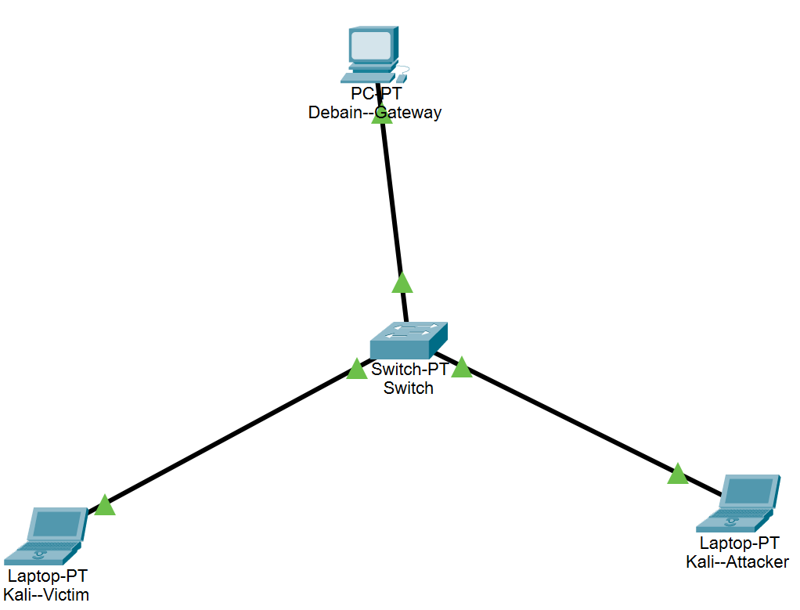

Attacker为扫描端，Attacker作为扫描端，Victim作为扫描的靶机。

### 端口状态模拟

- 查看当前防火墙的状态和现有规则

```shell
ufw status
```

- 关闭状态：对应端口没有开启监听, 防火墙没有开启。

  ```shell
  ufw disable
  ```

- 开启状态：对应端口开启监听(apache2基于TCP, 在80端口提供服务; DNS服务基于UDP,在53端口提供服务)，防火墙处于关闭状态。

  ```shell
  systemctl start apache2 # port 80
  systemctl start dnsmasq # port 53
  ```

- 过滤状态：对应端口开启监听, 防火墙开启。

  ```shell
  ufw enable && ufw deny 80/tcp
  ufw enable && ufw deny 53/udp
  ```

### TCP connect scan

> 发送一个S，然后等待回应。
>
> 其中如果有回应且标识为RA-->目标端口处于关闭状态；如果有回应且标识为SA-->目标端口处于开放状态。这时TCP connect scan会回复一个RA，在完成三次握手的同时断开连接。

**code**

```python
from scapy.all import *


def tcpconnect(dst_ip, dst_port, timeout=10):
    pkts = sr1(IP(dst=dst_ip)/TCP(dport=dst_port,flags="S"),timeout=timeout)
    if pkts is None:
        print("Filtered")
    elif(pkts.haslayer(TCP)):
        if(pkts.getlayer(TCP).flags == 0x12):  #Flags: 0x012 (SYN, ACK)
            send_rst = sr(IP(dst=dst_ip)/TCP(dport=dst_port,flags="AR"),timeout=timeout)
            print("Open")
        elif (pkts.getlayer(TCP).flags == 0x14):   #Flags: 0x014 (RST, ACK)
            print("Closed")

tcpconnect('10.0.2.6', 80)
```

#### 端口关闭：

```shell 
sudo python tcp-connect-scan.py
```

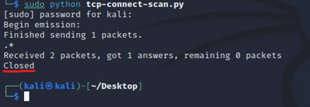

```shell
sudo ufw status

sudo netstat -anop | grep  LISTEN | grep -v unix

sudo tshark -r tcp-cnt-scan.pcap -Y "tcp or udp or icmp"
```

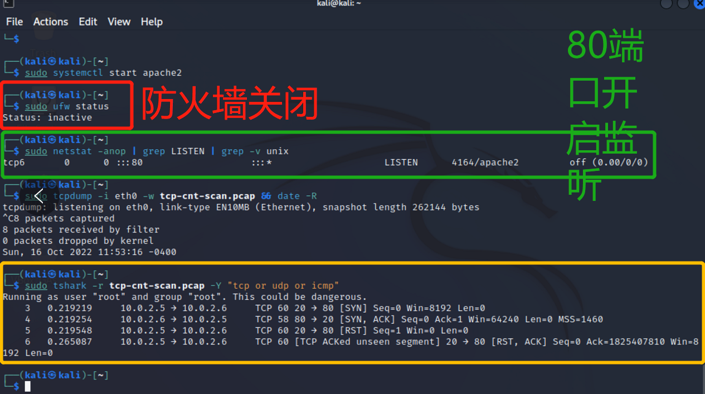

#### 端口开放：

```shell 
sudo python tcp-connect-scan.py
```

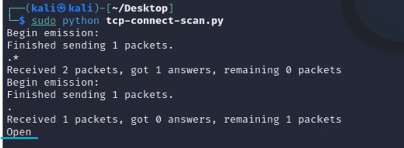

```shell
sudo systemctl start apache2

udo ufw ststus

sudo netstat -anop | grep -v unix

sudo tcpump -i enth0 -w tcp-cnt-scan.pcap &&date -R

sudo tshark -r tcp-cnt-scan.pcap -Y "tcp or icmp"
```

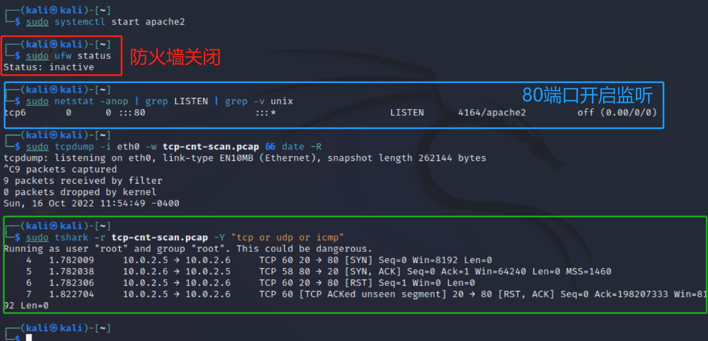

#### 端口过滤：

```shell
sudo python tcp-connect-scan.py
```

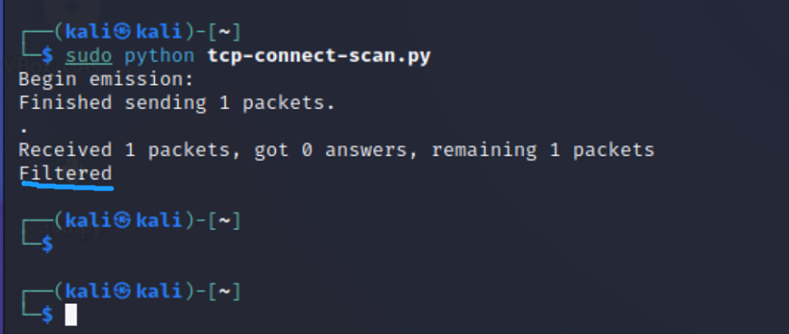

```shell
sudo ufw ststus

sudo netstatus -anop | grep LISTEN | grep -v unix

sudo tcpdump -i enth0 -w tcp-cnt-scan.pcap && date -v unix

sudo tcpdump -i enth0 -w tcp-cnt-scan.pcap&& date -R

sudo tshark -r tcp-cnt-sca.pcap -Y "tcp udp or icmp"
```

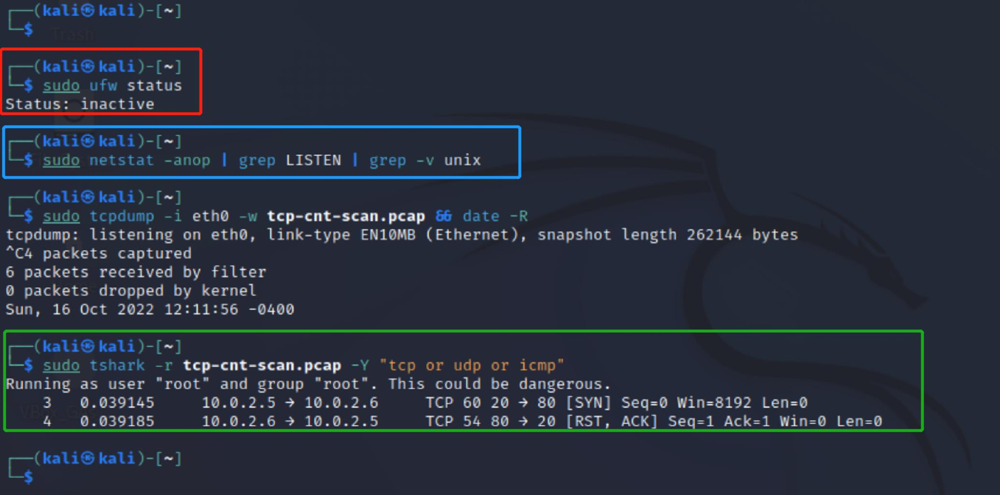

### TCP stealth scan

> 先发送一个S，然后等待回应。
>
> 如果有回应且标识为RA-->目标端口处于关闭状态；如果有回应且标识为SA-->目标端口处于开放状态。这时TCP stealth scan只回复R，不完成三次握手，直接取消建立连接。

**code**

```python
#! /usr/bin/python

from scapy.all import *


def tcpstealthscan(dst_ip, dst_port, timeout=10):
    pkts = sr1(IP(dst=dst_ip)/TCP(dport=dst_port, flags="S"), timeout=10)
    if (pkts is None):
        print("Filtered")
    elif(pkts.haslayer(TCP)):
        if(pkts.getlayer(TCP).flags == 0x12):
            send_rst = sr(IP(dst=dst_ip) /
                          TCP(dport=dst_port, flags="R"), timeout=10)
            print("Open")
        elif (pkts.getlayer(TCP).flags == 0x14):
            print("Closed")
        elif(pkts.haslayer(ICMP)):
            if(int(pkts.getlayer(ICMP).type) == 3 and int(stealth_scan_resp.getlayer(ICMP).code) in [1, 2, 3, 9, 10, 13]):
                print("Filtered")


tcpstealthscan('10.0.2.6', 80)
```

#### 端口关闭：

```shell
sudo python tcp-stealth-scan.py
```

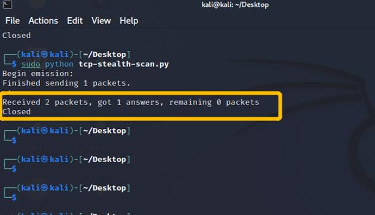

```shell
sudo ufw disable

sudo ufw status

sudo systemctl stop apache2

sudo netstat -anop | grep LISTEN | grep -v unix

sudo tcpdump -i enth0 -w tcp-cnt-scan.pcap && date -R

sudo tshark -r tcp-cnt-scan.pcap -Y "tcp or udp icmp"
```

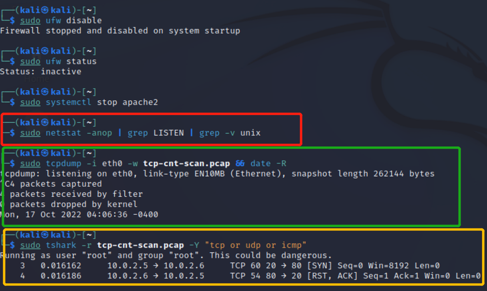

#### 端口开放：

```shell
sudo python tcp-stealth-scan.py
```

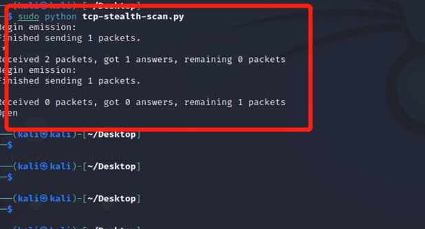

```shell
sudo systemctl start apache2

sudo netstat -anop | grep LISTEN |grep -v unix

sudo ufw status

sudo tcpdump -i enth0 -w tcp-cnt-scan.pcap && date -R

sudo tshark -r tcp-cnt-scan.pcap -Y "tcp or udp or icmp"
```


#### 端口过滤：

```shell
sudo python tcp-stealth-scan.py
```

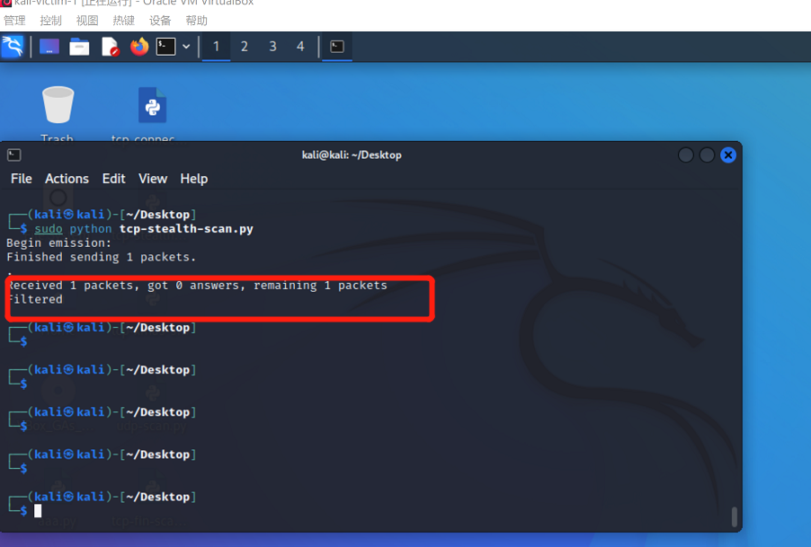

```shell
sudo ufw enable && sudo ufw deny 80/tcp && sudo ufw status
sudo netstat -anop |grep LIsten | grep -v unix
sudo tcpdump -i enth0 -w tcp-cnt-scan.pcap && date -r
sudo tshark -r tcp-cnt-scan.pcap -Y "tcp or udp or icmp"
```

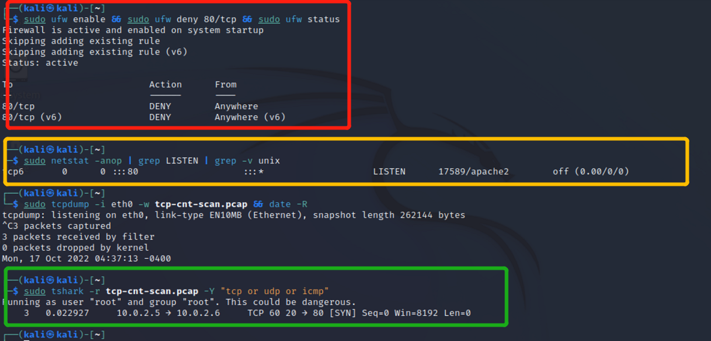


### TCP Xmas scan

> 这是一种隐蔽性扫描，当端口处于关闭状态时，会回复一个RST包；其余所有状态都将不回复。

**code**

```python
#! /usr/bin/python
from scapy.all import *


def Xmasscan(dst_ip, dst_port, timeout=10):
    pkts = sr1(IP(dst=dst_ip)/TCP(dport=dst_port, flags="FPU"), timeout=10)
    if (pkts is None):
        print("Open|Filtered")
    elif(pkts.haslayer(TCP)):
        if(pkts.getlayer(TCP).flags == 0x14):
            print("Closed")
    elif(pkts.haslayer(ICMP)):
        if(int(pkts.getlayer(ICMP).type) == 3 and int(pkts.getlayer(ICMP).code) in [1, 2, 3, 9, 10, 13]):
            print("Filtered")


Xmasscan('10.0.2.6', 80)
```

#### 端口关闭：

```shell
sudo python tcp-xmas-scan.py
```

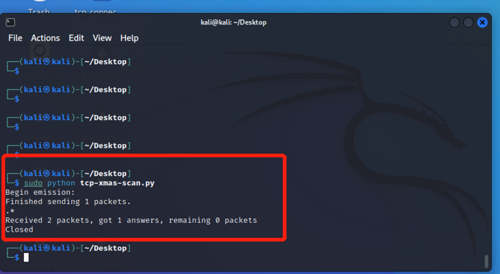

```shell 
sudo ufw status
sudo systemctl stop apache2
sudo netstat -anop |grep LIsten | grep -v unix
sudo tcpdump -i enth0 -w tcp-cnt-scan.pcap && date -R
sudo tshark -r tcp-cnt-scan.pcap -Y "tcp or udp or icmp"
```

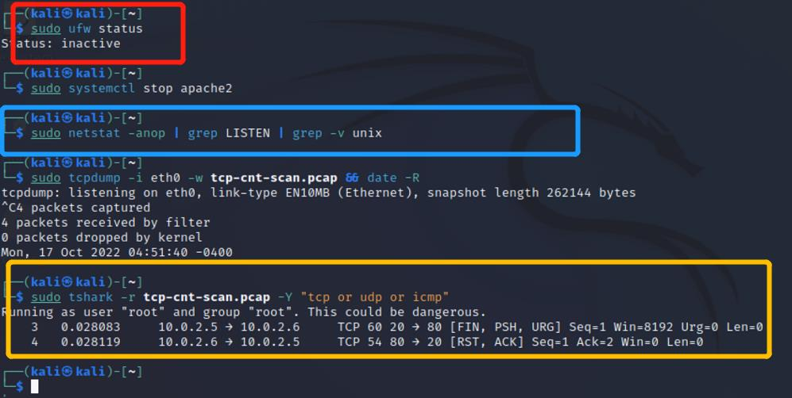

#### 端口开放：

```shell
sudo python tcp-xmax-scan.py
```

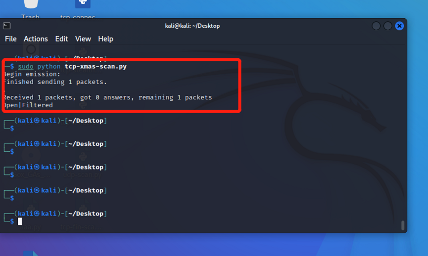

```
sudo ufw status
sudo systemctl stop apache2
sudo netstat -anop |grep LIsten | grep -v unix
sudo tcpdump -i enth0 -w tcp-cnt-scan.pcap && date -R
sudo tshark -r tcp-cnt-scan.pcap -Y "tcp or udp or icmp"
```


#### 端口过滤：

```shell
sudo python tcp-xmas-scan.py
```

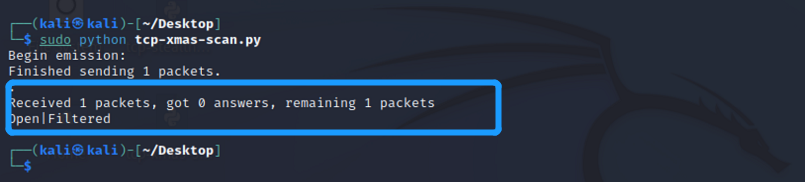

```shell
sudo ufw enable && sudo ufw deny 80/tcp && sudo ufw status
sudo netstat -anop | grep LISTEN | grep -v unix
sudo tcpdump -i enth0 -w tcp-cnt-scan.pcap && date -R
sudo tshark -r tcp-cnt-scan.pcap -Y "tcp or udp or icmp"
```

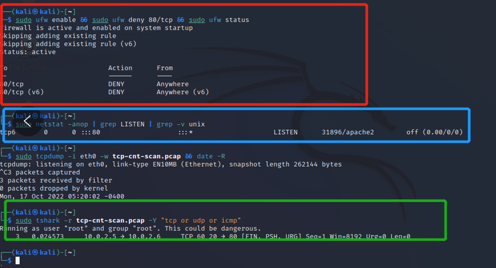


### TCP FIN scan

> 仅发送FIN包，FIN数据包能够通过只监测SYN包的包过滤器，隐蔽性较SYN扫描更⾼，此扫描与Xmas扫描也较为相似，只是发送的包未FIN包，同理，收到RST包说明端口处于关闭状态；反之说明为开启/过滤状态。

**code**

```python
#! /usr/bin/python
from scapy.all import *


def finscan(dst_ip, dst_port, timeout=10):
    pkts = sr1(IP(dst=dst_ip)/TCP(dport=dst_port, flags="F"), timeout=10)
    if (pkts is None):
        print("Open|Filtered")
    elif(pkts.haslayer(TCP)):
        if(pkts.getlayer(TCP).flags == 0x14):
            print("Closed")
    elif(pkts.haslayer(ICMP)):
        if(int(pkts.getlayer(ICMP).type) == 3 and int(pkts.getlayer(ICMP).code) in [1, 2, 3, 9, 10, 13]):
            print("Filtered")


finscan('10.0.2.6', 80)
```

#### 端口关闭：

```shell
sudo python tcp-fin-scan.py
```

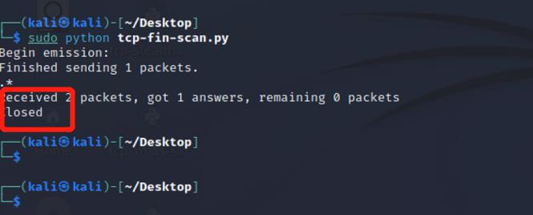

```shell
sudo ufw disable
sudo systemctl stop apache2
sudo netstat -anop |grep LISTEN | grep -v unix
sudo tcpdump -i enth0 -w tcp-cnt-scan.pcap && date -R
sudo tshark -r tcp-cnt-scan.pcap -Y "tcp or udp or icmp"
```

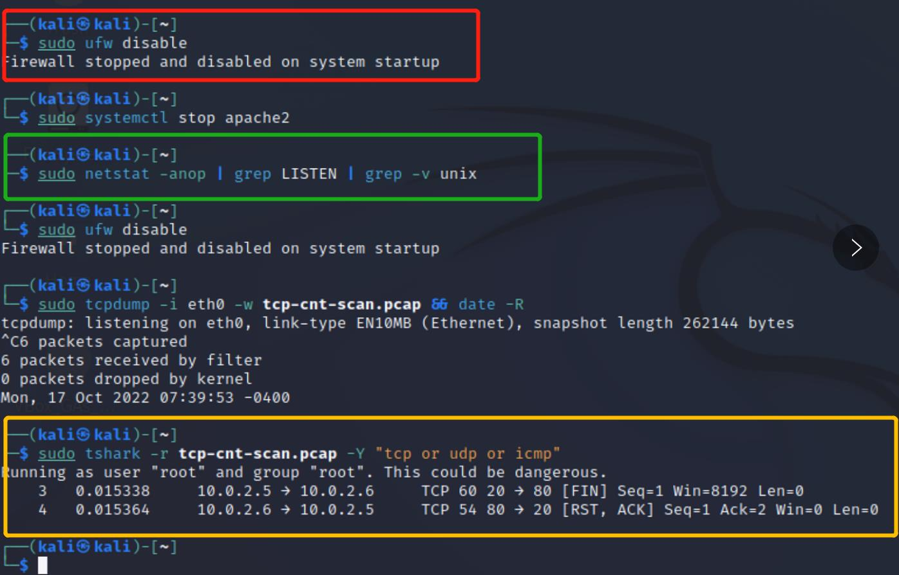

#### 端口开放：

```shell
sudo python tcp-fin-scan.
```

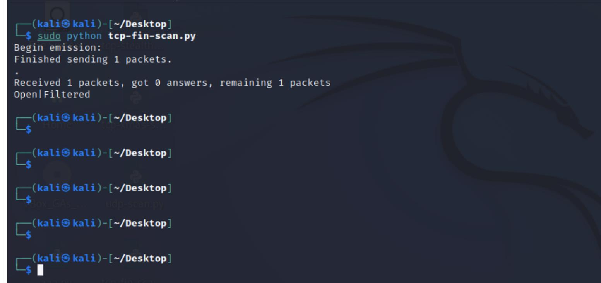

```
sudo systemctl stop apache2
sudo netstat -anop |grep LISTEN | grep -v unix
sudo ufw status
sudo tcpdump -i enth0 -w tcp-cnt-scan.pcap && date -R
sudo tshark -r tcp-cnt-scan.pcap -Y "tcp or udp or icmp"
```

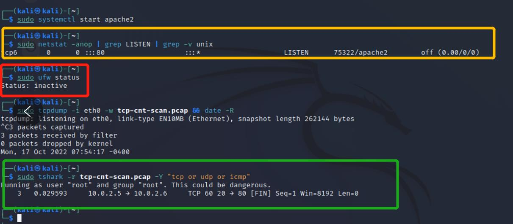

#### 端口过滤：

```shell
sudo python tcp-fin-scan.py
```


```shell
sudo ufw enable && sudo ufw deny 80/tcp && sudo ufw status
sudo netstat -anop |grep LIsten | grep -v unix
sudo tcpdump -i enth0 -w tcp-cnt-scan.pcap && date -R
sudo tshark -r tcp-cnt-scan.pcap -Y "tcp or udp or icmp"
```

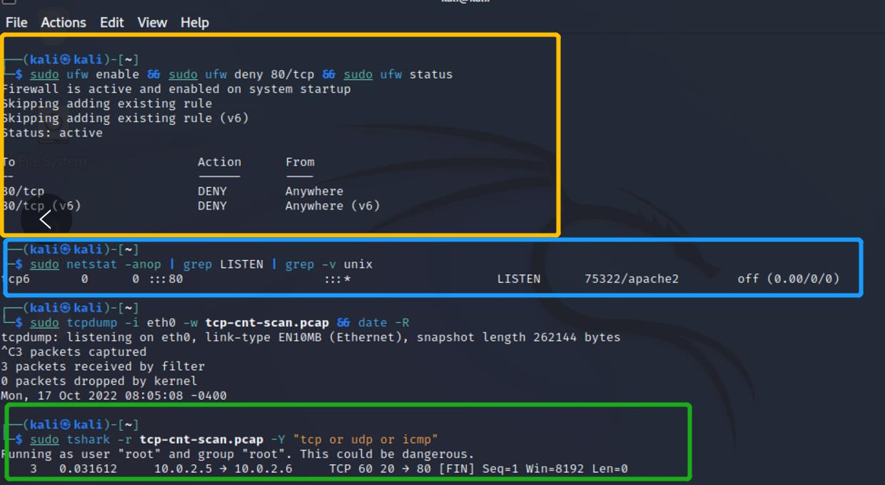


### TCP NULL scan

> 发送的包中关闭所有TCP报⽂头标记，收到RST包-->端口为关闭状态；未收到RST包-->端口为开启/过滤状态。

**code**

```python
#! /usr/bin/python
from scapy.all import *


def nullscan(dst_ip, dst_port, timeout=10):
    pkts = sr1(IP(dst=dst_ip)/TCP(dport=dst_port, flags=""), timeout=10)
    if (pkts is None):
        print("Open|Filtered")
    elif(pkts.haslayer(TCP)):
        if(pkts.getlayer(TCP).flags == 0x14):
            print("Closed")
    elif(pkts.haslayer(ICMP)):
        if(int(pkts.getlayer(ICMP).type) == 3 and int(pkts.getlayer(ICMP).code) in [1, 2, 3, 9, 10, 13]):
            print("Filtered")


nullscan('10.0.2.6', 80)
```

#### 端口关闭：

```shell
sudo python tcp-null-scan.py
```


```shell
sudo ufw disable
sudo ufw status
sudo systemctl stop apache2
sudo netstat -anop |grep LIsten | grep -v unix
sudo tcpdump -i enth0 -w tcp-cnt-scan.pcap && date -R
sudo tshark -r tcp-cnt-scan.pcap -Y "tcp or udp or icmp"
```

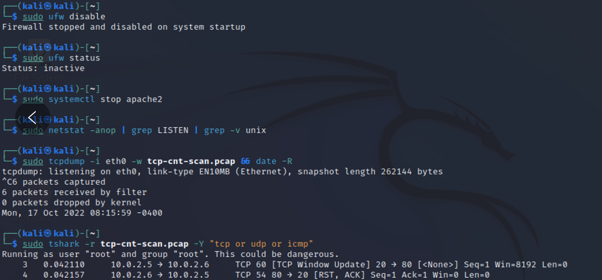

#### 端口开放：

```shell
sudo python tcp-null-scan.py
```

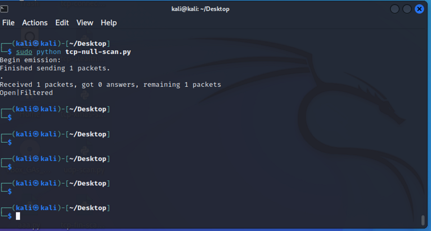

```shell
sudo systemctl stop apache2
sudo netstat -anop |grep LIsten | grep -v unix
sudo ufw status
sudo tcpdump -i enth0 -w tcp-cnt-scan.pcap && date -R
sudo tshark -r tcp-cnt-scan.pcap -Y "tcp or udp or icmp"
```

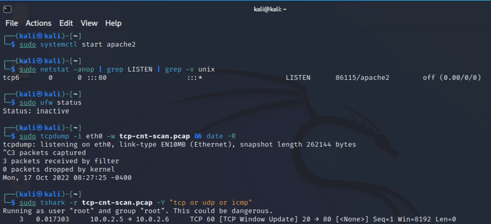

#### 端口过滤：

```shell
sudo python tcp-null-scan.py
```

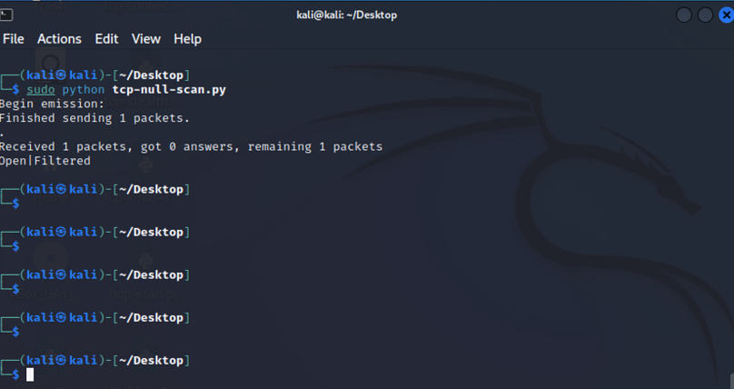

```shell
sudo ufw enable && sudo ufw deny 80/tcp && sudo ufw status
sudo netstat -anop |grep LIsten | grep -v unix
sudo tcpdump -i enth0 -w tcp-cnt-scan.pcap && date -R
sudo tshark -r tcp-cnt-scan.pcap -Y "tcp or udp or icmp"
```

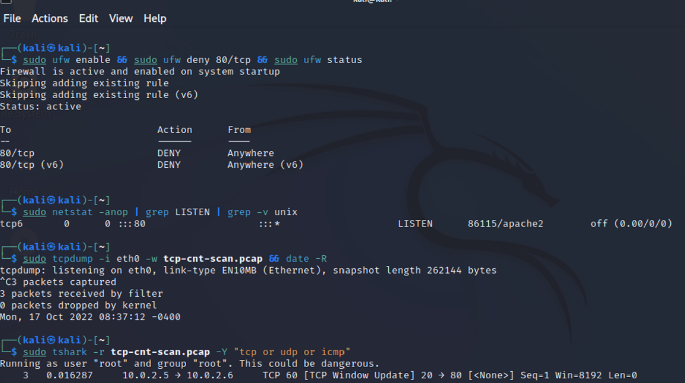


### UDP scan

> 一种开放式扫描，通过发送UDP包进行扫描。当收到UDP回复时-->端口为开启状态；未收到UDP回复时-->端口为关闭/过滤状态。

**code**

```python
from scapy.all import *
def udpscan(dst_ip, dst_port, dst_timeout=10):
    resp = sr1(IP(dst=dst_ip)/UDP(dport=dst_port), timeout=dst_timeout)
    if (resp is None):
        print("Open|Filtered")
    elif (resp.haslayer(UDP)):
        print("Open")
    elif(resp.haslayer(ICMP)):
        if(int(resp.getlayer(ICMP).type) == 3 and int(resp.getlayer(ICMP).code) == 3):
            print("Closed")
        elif(int(resp.getlayer(ICMP).type) == 3 and int(resp.getlayer(ICMP).code) in [1, 2, 9, 10, 13]):
            print("Filtered")
        elif(resp.haslayer(IP) and resp.getlayer(IP).proto == IP_PROTOS.udp):
            print("Open")
udpscan('10.0.2.6', 53)
```

#### 端口关闭：

```shell
sudo python udp_scan.py
```

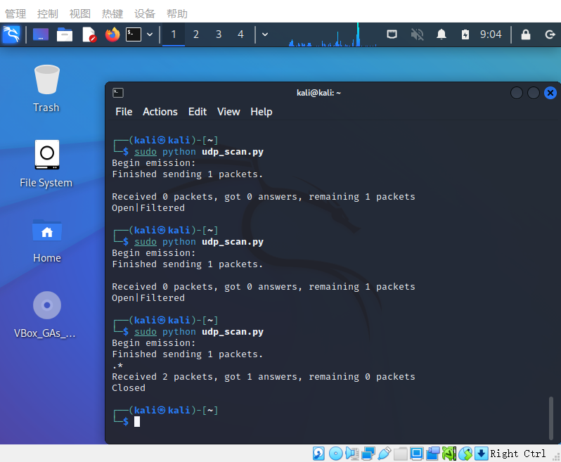

```shell
sudo ufw status
sudo netstat -anop |grep LIsten | grep -v unix
sudo tcpdump -i enth0 -w tcp-cnt-scan.pcap && date -R
sudo tshark -r tcp-cnt-scan.pcap -Y "tcp or udp or icmp"
```

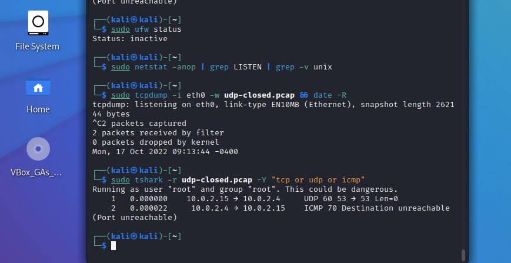

#### 端口开放：

```shell
sudo python tcp_connect_scanning.py
sudo python udp_scan.py
```

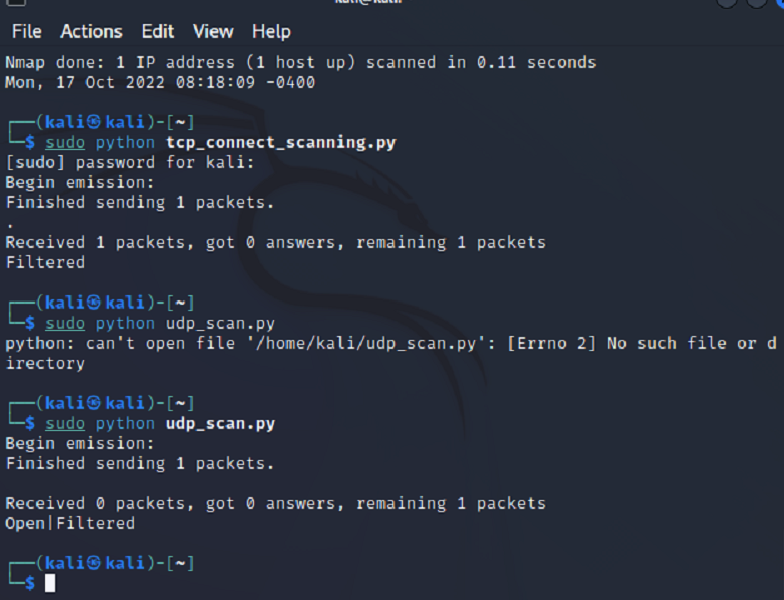

```shell
sudo ufw status
sudo netstat -anop |grep LIsten | grep -v unix
sudo tcpdump -i enth0 -w tcp-cnt-scan.pcap && date -R
sudo tshark -r tcp-cnt-scan.pcap -Y "tcp or udp or icmp"
```

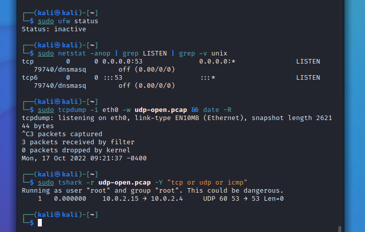

#### 端口过滤：

```shell
sudo python tcp_connect_scanning.py
sudo python udp_scan.py
```


```shell
sudo ufw status && sudo ufw deny 53/udp
sudo netstat -anop |grep LIsten | grep -v unix
sudo tcpdump -i enth0 -w tcp-cnt-scan.pcap && date -R
sudo tshark -r tcp-cnt-scan.pcap -Y "tcp or udp or icmp"
```

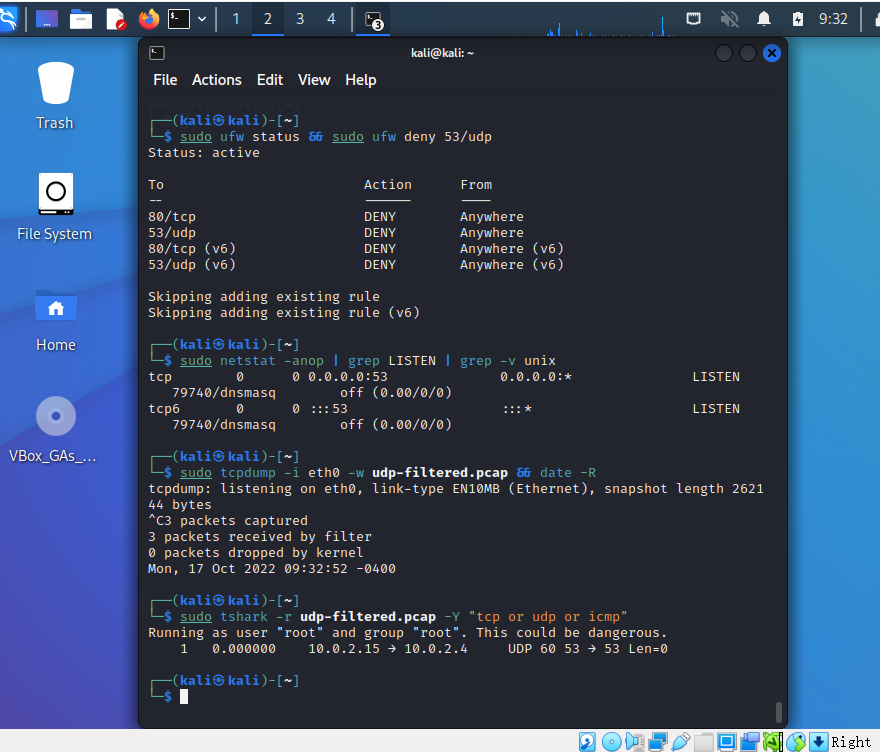


## 实验结果总结

### 扫描方式及端口状态的对应关系

（1）TCP connect / TCP stealth

开放状态下：完整完成三次握手，抓到ACK&RST包

关闭状态下：只能收到一个RST包

过滤状态下：收不到任何的TCP包

（2）TCP Xmas / TCP FIN / TCP NULL

开放状态下：收不到TCP回复包

关闭状态下：收到一个RST包

过滤状态下：收不到TCP回复包

（3）UDP

开放状态下：收到UDP回复包

关闭状态下：收不到UDP回复包

过滤状态下：收不到UDP回复包

### 提供每一次扫描测试的抓包结果并分析与课本中的扫描方法原理是否相符？

抓包以截图形式提供表现在每次扫描结果中，完全相符。

## 参考资料

[chap0x05 by kal1x · Pull Request #4 · CUCCS/2021-ns-public-EddieXu1125 (github.com)](https://github.com/CUCCS/2021-ns-public-EddieXu1125/pull/4/commits/5be040f0313dbc1f3b81a888d6747e39cdcebc2f#diff-942e0dde3732f45f2695f0504771d0eb779ec850cdbe73ab1274ba7ad9041f63)